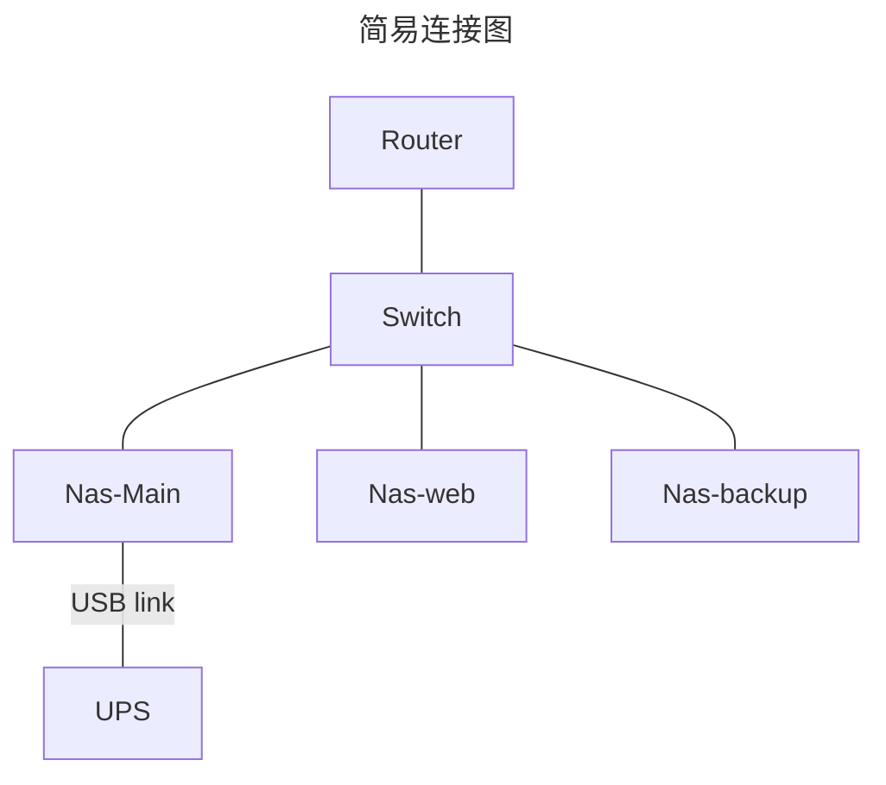

## 场景说明

多个NAS 或者实体服务器，在单个UPS的情况下是正确的 nas 正确使用方法，这样保证数据不会 `all in bomb` （除了异地数据备份这点没满足，至少鸡蛋没在一个篮子里面）

那么多个NAS在同一局域网下，连接图如下



- 使用 [nut](https://networkupstools.org/) 是 C/S 架构的软件，来作为集群 UPS 管理
- 这个时候，`Nas-Main` 主 nas ，就作为 `网络UPS服务器` 来使用
- 其他设备，连接上`网络UPS服务器` 来接收 `断电安全关机操作`，作为 `受控设备`

> 它的优点在于省成本，不用买很贵的带网络管理卡的 UPS，只需要一个 master 节点能和 UPS 通信就足够

断电时候 `网络UPS服务器` 节点可以通过网络通知 `受控设备` 节点关机

> tips: `网络UPS服务器` 占用端口 `3493` 也就是 [nut](https://networkupstools.org/) 服务端端口

但缺点是，来电后，所有节点启动时，要先等 `网络UPS服务器` 节点启动 ，然后再在 `网络UPS服务器` 节点上使用 `wake-on-lan` 唤醒其他节点，这个后面通过 docker 配置一套开机服务即可解决

### UGOS Pro 系统存在问题

系统版本: 1.0.0.0760 下

UPS 使用 `SNMP不断电系统` 支持的 SNMP 版本为 `v1` 或者 `v2c` 不安全，不建议使用这方式

## 配置 网络UPS服务器

### apcupsd + nut 服务端

apcupsd 具体配置过程不在这里讲，有需要见用户手册

- [http://www.apcupsd.com/](http://www.apcupsd.com/)
- 用户手册 [http://www.apcupsd.org/manual/manual.html#basic-user-s-guide](http://www.apcupsd.org/manual/manual.html#basic-user-s-guide)

要求执行，下面的命令，返回的 UPS 信息正常，打开 apcupsd 服务，端口为 3551

```bash
apcaccess status
```

主要是配置 nut 服务端

```bash
# 安装 nut 服务
sudo apt install -y nut
```

修改 `/etc/nut/nut.conf`，设置 MODE 值为 netserver

```conf
MODE=netserver
```

修改 `/etc/nut/upsd.conf`，去掉注释或写入以下内容以绑定本地 IP 和端口

```conf
LISTEN 0.0.0.0 3493
```

打开 `/etc/nut/ups.conf`，写入以下内容以将 apcupsd 作为 UPS 源

```conf
[ups]
 driver = apcupsd-ups
 port = 127.0.0.1:3551
 desc = "SANTAK TG-BOX"
```

> `port = 127.0.0.1:3551` 这里 需要改为你的 apcupsd 主机配置
> `desc = ` 为描述

修改  `/etc/nut/upsd.use`r，写入以下内容以为 NAS 创建一个用户， 如果有多个用户 增加即可

```
[synologyNAS]
 password = synology
 actions = SET
 instcmds = ALL
 upsmon slave
```

> 如果需要给 群晖作为受控机，按照上面的设置 password 和 upsmon 即可

### 群晖作为 网络UPS服务器

在`控制面板`的 `不断电系统`中
  - 勾选`启用 UPS 支持`
  - 选好 `UPS 类型` 演示为 USB 连接
  - 勾选 `启用网络 UPS 服务器`


在 `允许的 Synology NAS 设备` 中，点击后添加 `受控设备` 的 ip，保存即可

如果没添加到 `允许的 Synology NAS 设备` 并`保存设置`，后面验证时，会报错

```
Init SSL without certificate database
Error: Access denied
```

## 配置 UPS服务 受控端

> `UGOS Pro` 系统为 debian ，支持安装 nut 作为受控端

### 检查服务端配置

在配置 受控端前，需要在 `网络UPS服务器` 中配置好受控端信息，否则连接失败

### nut clent 作为受控端

```bash
sudo apt install -y nut
```

- 修改配置文件，路径为 `/etc/nut/nut.conf`  模式改为客户端 `MODE=netclient`

```conf
MODE=netclient
```

- 修改服务指向配置文件，路径为 `/etc/nut/upsmon.conf` ，修改以下参数，UPS 服务指向 `MONITOR ups@host`，这里以 192.168.50.50 这个 IP 作为 `网络UPS服务器` 来 演示

```conf
MONITOR ups@192.168.50.50 1 monuser secret slave
```

- 配置生效

```bash
$ sudo systemctl restart nut-client
# 查看状态
$ sudo systemctl status nut-client
```

- 线路测试

不想通过拔电源来测试上面设置是否生效

```bash
$ upsc ups@192.168.50.50
Init SSL without certificate database
battery.charge: 5
battery.charge.low: 20
battery.runtime: 126
battery.type: PbAc
device.mfr: EATON
device.model: SANTAK TG-BOX 850
device.serial: Blank
device.type: ups
...
```

获取到 UPS 服务的信息，则为成功，测试通过设置 nut-client 为开机启动

```bash
$ sudo systemctl enable nut-client
$ sudo systemctl restart nut-client
```

### 群晖NAS 作为 受控端

- 打开你的群晖 DSM 控制面板
- 选择 `硬件和电源` 中的 `不断电系统`
  - 勾选 `启用 UPS 支持`
  - 网络不断电系统类型选择为 `Synology 不断电系统服务器`
  - 在网络不断电系统服务器 IP 地址中 输入你的 `网络UPS服务器` 主机的 IP 地址
- 点击应用，稍等一会即可看到保存成功的提示，并出现一个按钮 `设备信息`
- 点开之前没有出现的 `设备信息` 你将可以看到 UPS 的当前状态

## 网络UPS服务器 配置来电唤醒其他设备

- 配置前需要找到 受控端支持 网络唤醒的网卡 mac 地址，获取方式为

```bash
$ ifconfig enp2s0
# ether 后面跟着就是
```

配置唤醒其他设备，需要 docker 和 docker-compse

- docker-compse 配置例子

```yml
# more info see https://docs.docker.com/compose/compose-file/
#version: '3.8' # https://docs.docker.com/compose/compose-file/compose-versioning/
services:
  wakeonlan-foo-server:
    container_name: wakeonlan-foo-server
    image: fopina/wakeonlan:v1.1.2-1 # https://hub.docker.com/r/fopina/wakeonlan/tags
    network_mode: "host"
    environment:
      - TZ=Asia/Shanghai
    command: wake <mac addr>
    restart: on-failure # https://docs.docker.com/compose/compose-file/#restart
```

- `<mac addr>` 换为受控机的 mac 地址
- 有多台设备需要唤醒，直接配置多个 service 即可

应用容器编排

```bash
docker-compose up -d --remove-orphans
```

> 这个容器编排，会在 下一次重启的时候，因为 `restart: on-failure` 而做到开机启用

